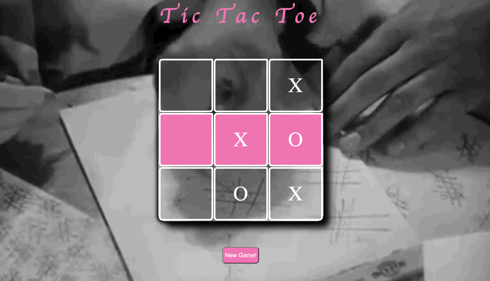

# Tic-Tac-Toe
 #### Project Goal - I  designed a functional game utilizing object-oriented procedures. This game has two players, each can take their turn with a click of a square. Once there are three of the same in a row the game generates a winner! A "New Game" button allows for the game to be reset and replayed.
 [See it Live here!](https://awesome-sinoussi-1d341e.netlify.app)
 
# Made with:
#### HTML5,CSS, Javascript
# Lesson Learned:
#### I learned that OOP is efficient method. OOP allows you to reuse and repurpose your code. I am excited to use it in the future.
